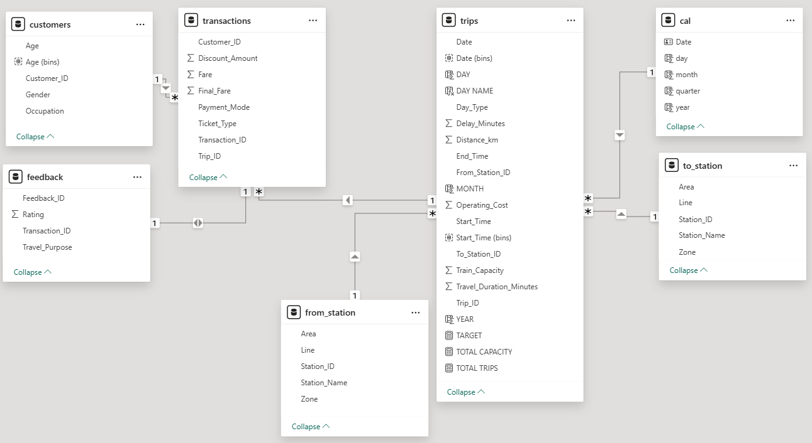
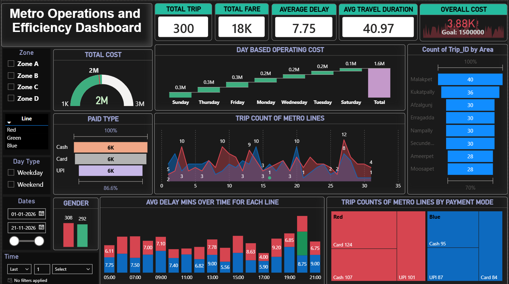

 <H1> 🚇 Hyderabad Metro Data Summary Dashboard <H1>

 

<H2> Dataset Structure </H2>

| Category     | Key Fields                                  |
| ------------ | ------------------------------------------- |
| Customers    | Age, Gender, Occupation                     |
| Transactions | Fare, Final Fare, Payment Mode, Ticket Type |
| Trips        | Date, Delay, Distance, Duration, Cost       |
| Stations     | Line, Zone, Station Name                    |
| Feedback     | Rating, Travel Purpose                      |

  

#  Data Model

       Star schema
       Fact: Trips, Transactions
       Dimensions: Customers, Stations, Date

 
 

# DASHBOARD

  

#  Core Metrics

| Metric              | Value |
| ------------------- | ----- |
| Total Trips         | 300   |
| Total Revenue       | 18K   |
| Avg Delay (mins)    | 7.75  |
| Avg Duration (mins) | 40.97 |
| Total Cost          | 3.8M  |

##  Key Observations

     Average delay under 10 minutes
 

     Even distribution across payment modes
 

     Few stations contribute major traffic

  

# Tools

    Power BI, Excel, DAX

  

## 👤 Author

Mohanraj S

[POWER BI DASHBOARD](https://app.powerbi.com/links/kwpYIIcSVL?ctid=4cf224cc-7ee1-4885-aacc-4cb2b9b12fe2&pbi_source=linkShare)
